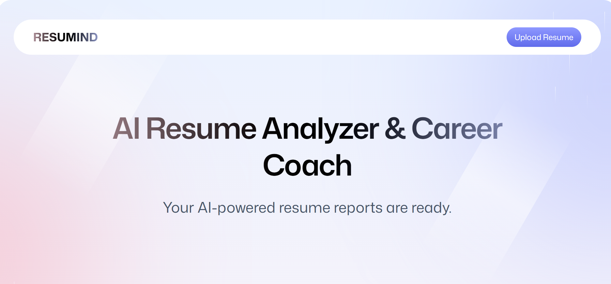
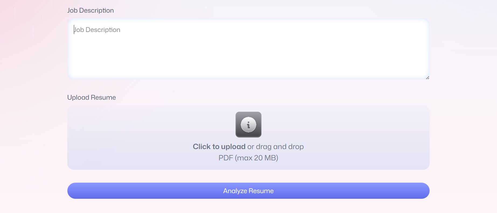
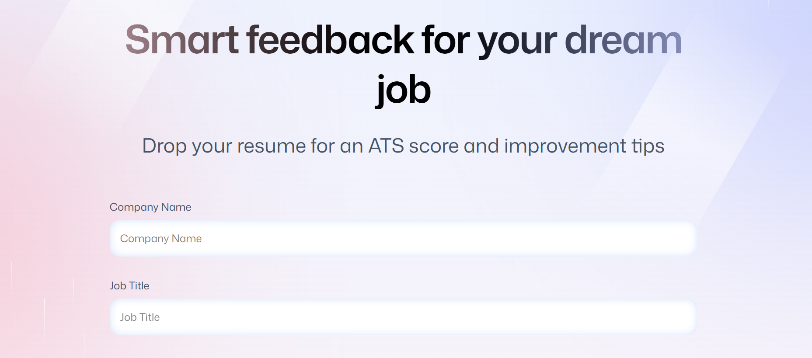

# AI Resume Analyzer 🚀

A modern AI-powered Resume Analysis platform that helps job seekers improve their resumes with intelligent feedback, ATS scoring, and job-specific recommendations.

## 📌 Project Overview

AI Resume Analyzer is a full-stack style web application designed to analyze resumes against job requirements and provide actionable improvement suggestions.

The application allows users to upload resumes, receive AI-based evaluations, and review detailed feedback about resume quality, structure, skills, and ATS compatibility.

## ✨ Key Features

### 🤖 AI Resume Review
- Upload resume files
- Generate AI-powered resume analysis
- Get ATS compatibility scoring
- Receive improvement recommendations

### 📊 Resume Feedback Dashboard
- Overall resume score
- Category-wise evaluation:
  - Content
  - Structure
  - Skills
  - Tone & Style

### 🔐 User Authentication
- Secure sign-in flow
- Personalized resume history
- User-based data management

### 📁 Resume Management
- Resume upload and storage
- Resume preview
- Previous analysis tracking

### 🎨 Modern Interface
- Responsive UI
- Clean dashboard design
- Reusable React components
- Smooth user experience

## 🛠 Technologies Used

### Frontend
- React.js
- TypeScript
- React Router
- Tailwind CSS
- Zustand

### AI & Data Layer
- AI Resume Evaluation
- Cloud Storage
- Browser-based services

### Development Tools
- Vite
- Git
- GitHub

## 📂 Application Structure
app
│
├── components
│ ├── ResumeCard
│ ├── Navbar
│ ├── ATS
│ ├── Summary
│ └── Details
│
├── routes
│ ├── home
│ ├── upload
│ ├── resume
│ └── auth
│
├── lib
│ ├── AI integration
│ ├── file handling
│ └── utilities
│
└── constants

## 📸 Screenshots

### Home Dashboard

### Resume Upload

### AI Feedback

